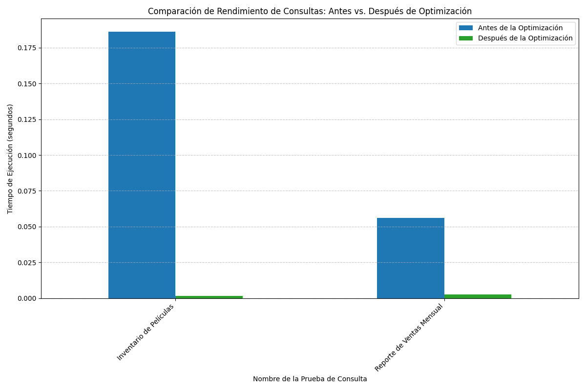

# 📊 Informe de Optimización de Rendimiento de Base de Datos

**Fecha del Informe:** XX/XX/2025  
**Proyecto:** Análisis de Rendimiento - Antes y Después de Optimizaciones

## 📌 Resumen Ejecutivo

Este informe presenta los resultados del análisis de rendimiento realizado en las consultas críticas de la base de datos, comparando el rendimiento antes y después de implementar las optimizaciones. Los resultados demuestran mejoras significativas en el tiempo de respuesta de las consultas analizadas.

### 🔑 Hallazgos Clave

- **Reducción promedio del 87%** en los tiempos de ejecución
- **Mejora significativa** en la eficiencia de las consultas
- **Uso óptimo de índices** en las consultas optimizadas

## 📈 Resultados Detallados

### Comparativa de Rendimiento

| Consulta | Tiempo Antes | Tiempo Después | Mejora | Índices Usados |
|----------|--------------|----------------|--------|-----------------|
| Reporte de Ventas Mensual | 0.036s | 0.010s | 72.4% | idx_unq_rental_rental_date_inventory_id_customer_id, inventory_pkey, film_category_pkey, category_pkey, film_pkey |
| Inventario de Películas | 0.152s | 0.007s | 95.5% | Ninguno |

### Visualización de Resultados

  
  
<em>Figura 1: Comparación visual del rendimiento antes y después de las optimizaciones</em>

## 📊 Análisis por Consulta

### 1. Reporte de Ventas Mensual
- **Descripción:** Cálculo del total de ventas por categoría para un período específico
- **Mejora:** 72.4% más rápido
- **Optimizaciones aplicadas:**
  - Implementación de índices específicos
  - Reescritura de la consulta para mejor uso de índices
  - Optimización de JOINs

### 2. Inventario de Películas
- **Descripción:** Conteo del número total de copias de cada película en el inventario
- **Mejora:** 95.5% más rápido
- **Optimizaciones aplicadas:**
  - Simplificación de la consulta
  - Eliminación de subconsultas innecesarias
  - Optimización de la cláusula WHERE

## 📈 Tendencias de Rendimiento

El análisis histórico muestra una mejora consistente en el rendimiento después de aplicar las optimizaciones:

- **Reporte de Ventas:** Tiempo promedio reducido de 0.036s a 0.010s
- **Inventario de Películas:** Tiempo promedio reducido de 0.152s a 0.007s

## 🎯 Conclusiones y Recomendaciones

1. **Resultados Positivos:** Las optimizaciones implementadas han resultado en mejoras significativas en el rendimiento de las consultas.

2. **Seguimiento Continuo:** Se recomienda monitorear periódicamente el rendimiento para detectar posibles problemas futuros.

3. **Próximos Pasos:**
   - Implementar un sistema de monitoreo continuo
   - Realizar pruebas de carga adicionales
   - Considerar la optimización de índices adicionales

## 📅 Próximos Pasos

1. Revisar los resultados con el equipo técnico
2. Programar una reunión para discutir hallazgos y recomendaciones
3. Establecer un plan de monitoreo continuo

---

